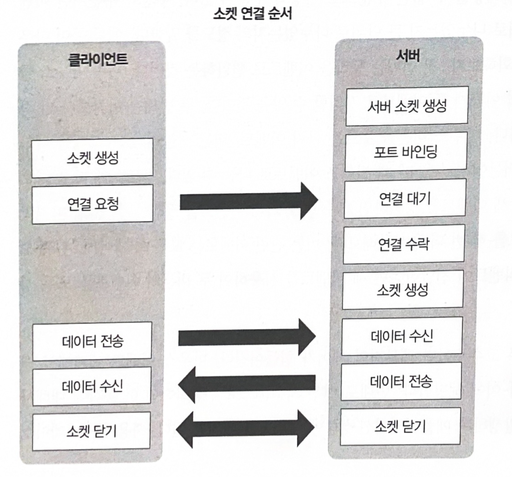
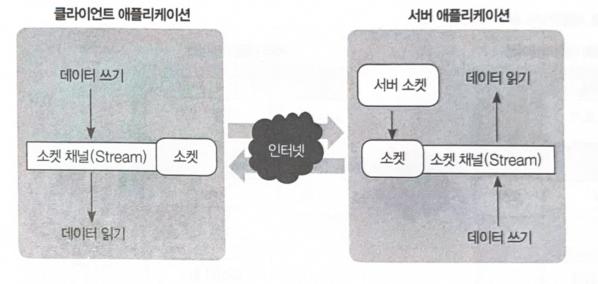
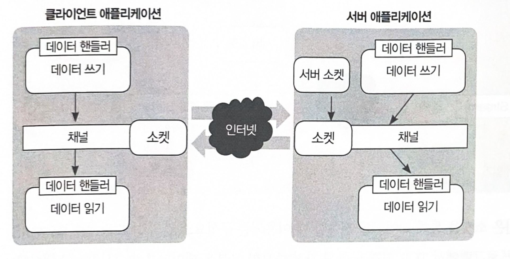

# 2.3.1 이벤트 기반 네트워크 프로그래밍
이벤트 기반 프로그래밍을 제공하려면 먼저 이벤트를 발생하는 객체를 정의해야 한다.
> 즉, 이벤트가 발생할 주체를 정의하고 그 주체에서 발생될 이벤트 종류를 정의해야한다.
그리고 발생하는 이벤트는 크게 소켓 연결, 데이터 송수신으로 나눌 수 있다.

네트워크 프로그램에서 클라이언트와 서버가 통신하는 방법이다.
> 1. 서버는 클라이언트의 연결을 수락하기 위하여 서버 소켓을 생성하고 포트를 서버 소켓에 바인딩한다.
> 2. 클라이언트의 연결을 수락하고 클라이언트의 데이터를 송수신할 소켓을 생성할 수 있다.
> 3. 클라이언트가 서버의 지정된 포트로 연결을 시도하면 서버는 서버 소켓으로부터 클라이언트와 연결된 소켓을 생성한다.
> 4. 클라이언트와 서버는 소켓을 사용한 데이터 송수신이 가능해진다.
위 그림처럼 서버와 클라이언트의 동작을 이벤트로 변환하면 이벤트 기반 네트워크 프로그래밍을 제공할 수 있다.
*****

이벤트가 아닌 동작 기반의 네트워크 프로그램을 작성한다면 이와같은 방법으로 데이터를 송수신해야 한다.  
위 그림은 소켓을 통해 데이터를 전송할 때 이용되는 구성요소 간의 상호 관계를 보여준다.  
네트워크 프로그램에서 TCP 연결과 함께 가장 중요한 부분은 데이터를 송수신하는 소켓이다.  
> 소켓이란 데이터 송수신을 위한 네트워크 추상화 단위인데, 일반적으로 네트워크 프로그램에서 소켓은 IP 주소와 포트를 가지고 있으며 양방향 네트워크 통신이 가능한 객체다.

소켓에 데이터를 기록하고 읽으려면 위 그림과 같이 소켓에 연결된 소켓 채널(NIO) 또는 스트림(Old Blocking IO)을 사용해야 한다.  
> 네티가 제공하는 소켓 채널과 구분해야 하므로 앞으로 표현은 스트림으로 통일한다.
클라이언트 애플리케이션이 소켓에 연결된 스트림에 데이터를 기록하면 소켓이 해당 데이터를 인터넷으로 연결된 서버로 전송한다.

*****

데이터 송수신을 이벤트 기반 네트워크 프로그래밍으로 바꾸면 이 그림과 같이 표현할 수 있다.  
네티는 데이터의 읽기 쓰기를 위한 이벤트 핸들러를 지원하는데, ChannelInboundHandlerAdapter가 이에 해당한다.
> 1장에서 배운 데이터 핸들러

이 그림은 네티가 소켓을 통해서 데이터를 송수신하는 방법을 표현하고 있다.  
기존 방법처럼 데이터를 소켓으로 전송하기 위해서 채널에 직접 기록하는 것이 아니라 데이터 핸들러를 통해서 기록한다.  
> 이러한 방법의 장점 :
> 1. 서버 애플리케이션의 코드를 클라이언트 애플리케이션에서 재사용
> 2. 각 이벤트에 따라서 로직을 분리 가능
네티의 이벤트 핸들러는 에러 이벤트도 같이 정의한다.
> 특정 이벤트에 대한 로직을 작성할 때 에러 처리에 대한 부담을 줄여준다.

*****
*****
비동기 호출이나 논블로킹 소켓을 사용하면 필연적으로 프로그램 복잡도가 증가한다.  
하지만 네티는 개발자가 기능의 구현에 집중할 수 있도록 이와 같은 기능을 프레임워크 레벨에서 API로 제공하고 있다.

  
