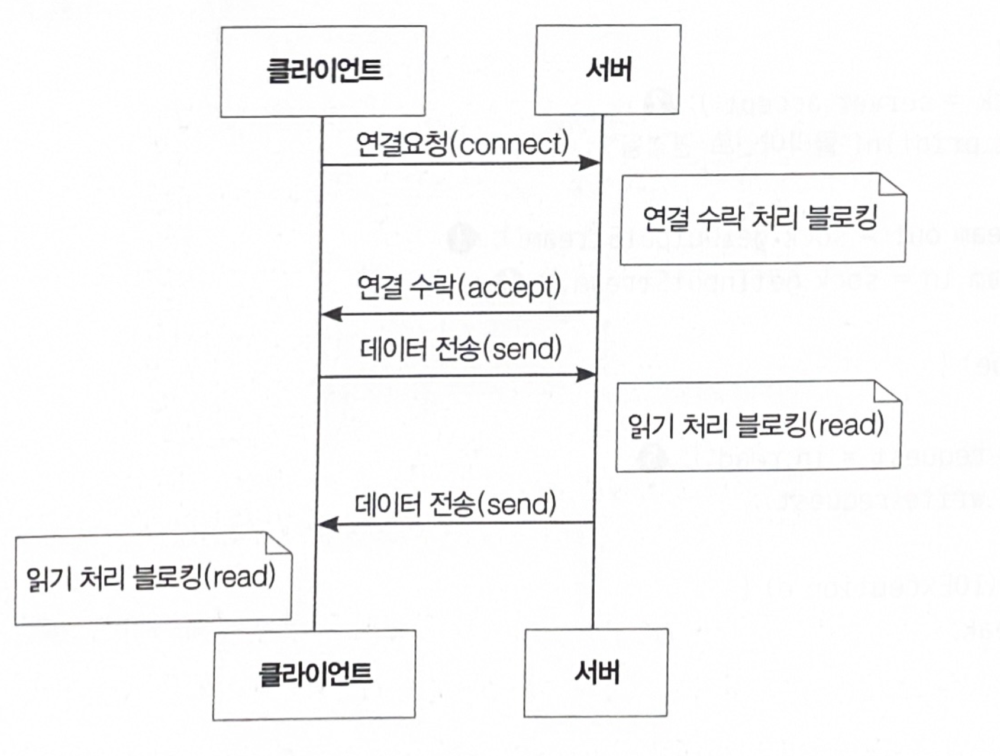
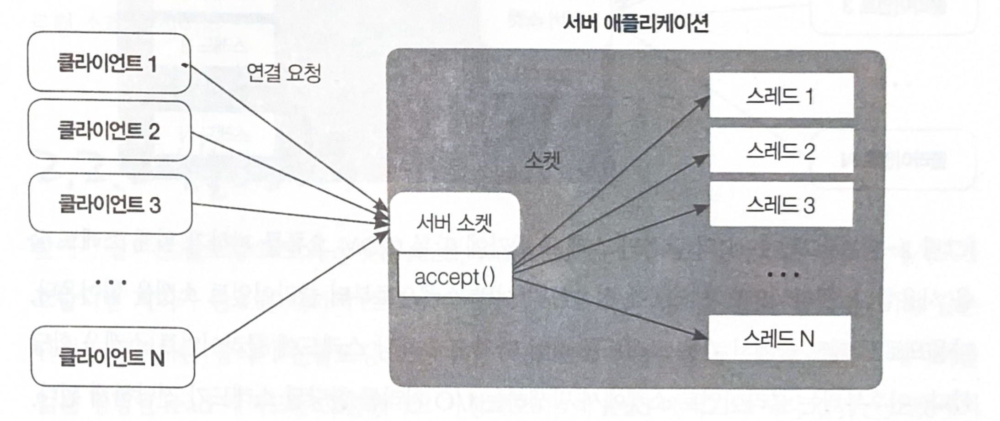
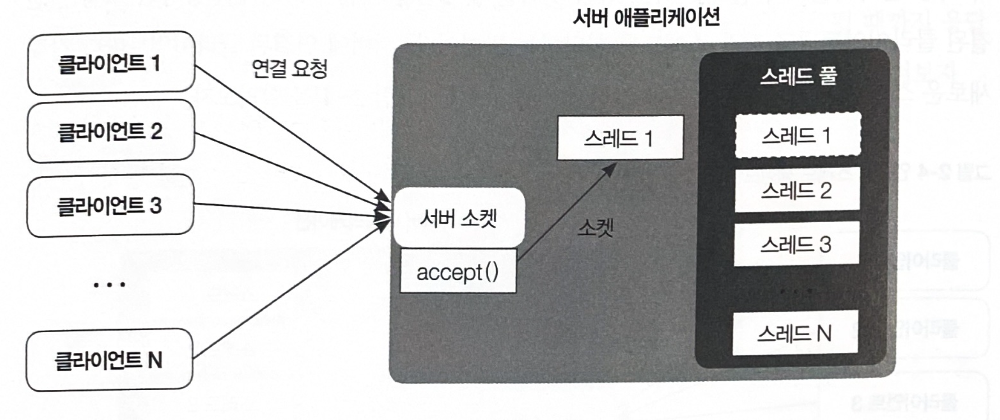

# 블로킹 소켓

```java
public class BlockingServer {
    // 블로킹 모드로 동작하는 서버

    public static void main(String[] args) throws IOException {
        BlockingServer server = new BlockingServer();
        server.run();
    }

    private void run() throws IOException {
        ServerSocket server = new ServerSocket(8888);
        System.out.println("접속 대기중..");

        while (true) {
            Socket sock = server.accept();
            System.out.println("클라이언트 연결됨");

            OutputStream out = sock.getOutputStream();
            InputStream in = sock.getInputStream();

            while (true) {
                try {
                    int request = in.read();
                    out.write(request);
                }
                catch (IOException e) {
                    break;
                }
            }
        }
    }
}
```




1. 클라이언트가 서버로 연결 요청을 보내면 서버는 연결을 수락하고 클라이언트와 연결된 소켓을 새로 생성하는데 이때 해당 메서드의 처리가 완료되기 전까지 스레드의 블로킹이 발생하게 된다.  
2. 클라이언트가 연결된 소켓을 통해서 서버로 데이터를 전송하면 서버는 클라이언트가 전송한 데이터를 읽기 위하여 read() 를 호출하고 이 메서드의 처리가 완료되기 전까지 스레드가 블로킹된다.  
3. 클라이언트 또한 마찬가지로 서버에서 클라이언트로 전송한 데이터를 읽기 위한 메서드에서 블로킹이 발생한다.  
4. 소켓으로 데이터를 전송하기 위한 write() 메서드도 동일하게 블로킹이 발생하는데, write()는 운영체제의 송신 버퍼에 전송할 데이터를 기록한다.  
   송신 버퍼의 남은 크기가 write() 에서 기록한 데이터의 크기보다 작다면 송신 버퍼가 비워질 때까지 블로킹된다.

*****

# 블로킹 소켓의 문제점 
블로킹 소켓은 데이터 입출력에서 스레드의 블로킹이 발생하기 때문에 동시에 여러 클라이언트에 대한 처리가 불가능하다.  
블로킹 모드의 소켓을 사용하는 서버가 다중 클라이언트의 접속 처리를 하지 못하는 문제점을 해결하기 위해서 등장한 모델은 연결된 클라이언트별로 각각 스레드를 할당하는 방법이다.

연결당 스레드 생성모델 : 아래 그림을 살펴보자.



1. 클라이언트가 서버에 접속하면 서버 소켓의 accept 메서드를 통해서 연결된 클라이언트 소켓을 얻어온다.  
2. 이때 블로킹 소켓은 I/O 처리에 블로킹이 발생하기 때문에 새로운 스레드를 하나 생성하고 그 스레드에게 클라이언트 소켓에 대한 I/O 처리를 넘겨주게 된다.
> 이렇게 해야 서버 소켓이 동작하는 스레드는 다음 클라이언트의 연결을 처리할 수 있게 된다.

### 그림에 있는 서버 소켓의 accept 메서드가 병목 지점이다. 
ServerSocket 클래스가 제공하는 accept 메서드는 단위 시간에 하나의 연결만을 처리하는 블로킹 모드로 동작하기 때문에 여러 클라이언트가 동시에 접속 요청을 하는 상황에서 대기시간이 길어진다는 단점이 있다.  
접속할 클라이언트 수가 정해져 있지 않은 상황에서도 문제가 있을 수 있다.  
서버에 접속하는 클라이언트 수가 증가하면 의도하지 않은 OOM 오류가 발생할 수 있다.

이런 오류를 방지하려면 서버에서 생성되는 스레드 수를 제한하는 방법인 *스레드 풀링* 을 사용하기도 한다.  

*****

# 스레드 풀링


연결당 스레드 생성모델의 단점인 스레드 증가에 따른 OOM 오류를 피하기 위해 스레드 폴링을 사용한다.

1. 클라이언트가 서버에 접속하면 서버 소켓으로부터 클라이언트 소켓을 얻어온다.  
2. 다음으로 스레드 풀에서 가용 스레드를 하나 가져오고 해당 스레드에 클라이언트 소켓을 할당한다.
3. 이 다음부터는 클라이언트 소켓에서 발생하는 I/O 처리를 할당된 스레드가 전담하게 된다.

> 이런 구조에서는 동시에 접속 가능한 사용자 수가 스레드 풀에 지정된 스레드 수에 의존하는 현상이 발생된다.

  
동시 접속이란 동일한 시간에 서버에 연결되어 있는 클라이언트 수를 의미한다. -> 동시 접속 수를 늘리기 위해서 스레드 풀의 크기를 heap의 최대 한도까지 늘리는게 합당한지 두가지를 생각해 볼 필요가 있다.
1. 가비지 컬렉션에 대한 고찰 : 가비지 컬렉션의 stop the world가 동작하게 되면 다른 스레드는 멈추기 때문에 애플리케이션이 먹통이 된 것처럼 보이게 된다.
> 특히 힙 크기가 클수록 가비지 컬렉션에 드는 시간이 길어진다. 즉, 힙 크기와 생성 가능한 스레드 수는 비례한다.

2. 운영체제에서 사용되는 컨텍스트 스위칭에 대한 고찰 :
> 컨텍스트 스위칭 : 한 프로세스에서 수행되는 스레드들이 CPU 점유를 위해서 자신의 상태를 변경하는 작업이다.
> 이때 수많은 스레드가 CPU 자원을 획득하기 위해 경쟁하면서 CPU 자원을 소모하기 때문에 실제 작업에 사용할 CPU가 적어지게 된다.

*****

이러한 블로킹 소켓의 동작 방식으로 인하여 블로킹 소켓을 사용한 서버는 충분히 많은 동시접속 사용자수를 수용하지 못한다.

이런 단점을 개선한 방식이 *논블로킹 소켓 방식* 이다.

