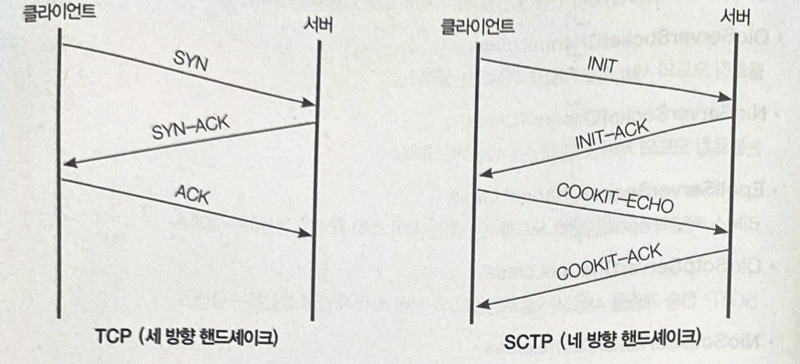
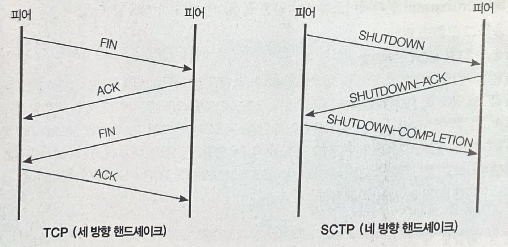

# SCTP, UDT 프로토콜  
SCTP (Stream Control Transmission Protocol)  
SCTP는 TCP의 연결지향 및 전송 보장 특성과 UDP의 메시지 지향 특성을 모두 갖추고 있다. -> TCP와 UDP의 장점을 모두 살리도록 설계되었기 때문이다.  
TCP는 3 Way handshake(SYN-ACK 구조)를 통해서 연결을 수립하지만 SCTP는 4 Way handshake(INIT-ACK, COOKIE-ECHO 구조)를 통해서 연결을 수립하는데,  
이때 연결 정보에 쿠키를 삽입하여 DoS와 같은 네트워크 공격으로부터 보호한다.  

*****

## TCP SCTP 핸드쉐이크 비교

TCP 전송 계층을 사용할 때 소켓 연결의 수립은 왼쪽과 같이 3단계를 거친다.  
SCTP 전송 계층을 사용할 때에는 오른쪽과 같이 4단계를 거치는데 앞의 2단계는 두 전송 계층 모두 같다.  
하지만 SCTP에서는 나머지 두 단계에서 쿠키 정보를 전송한다.  

SCTP의 다른 특징으로는 반 닫힘(Half Closed) 상태를 지원하지 않는 것을 들 수 있다.  
TCP 연결에서 반 닫힘이란 TCP 연결 해제를 요청하는 측의 FIN 패킷에 대한 결과로 상대방의 ACK와 FIN 패킷을 받은 상태를 말하며 이 상태에서는 커널의 포트 상태가 TIME_WAIT으로 변경된다.  
이와 같은 이유로 SCTP에서는 TIME_WAIT 상태가 존재하지 않는다.  

*****
## TCP와 SCTP 종료  

SCTP는 OSI 7계층에서 TCP, UDP와 같은 전송 계층에 해당하는 프로토콜로써 TCP와 UDP 이후의 차세대 프로토콜로 주목받고 있다.  
SCTP는 전송 계층에 해당하는 프로토콜이므로 운영체제에서 SCTP를 사용하려면 네트워크 드라이버 계층에서 지원해야 한다.  

*****
## UDT (UDP-based DATA Transfer) 
UDT 프로토콜은 OSI 계층에서 애플리케이션 계층에 해당한다.  
UDT는 UDP 프로토콜을 기반으로 작성된 애플리케이션 계층의 프로토콜이다. 즉, HTTP, SMTP와 같은 레벨의 애플리케이션 프로토콜이다.  
UDT는 신뢰성 있는 데이터 전송 프로토콜이며 애플리케이션 계층에 속하므로 하드웨어나 특정 플랫폼에 종속적이지 않은 장점이 있다.  
기존 UDP와 다르게 연결 유지를 지원하며 양방향 통신을 지원한다.  
고성능 분산 컴퓨팅의 데이터 전송에 사용된다.  

*****
# 중요! 공부해도 맨날 까먹는 네트워크 7계층 
1. 물리(Physical) 계층:
전기적, 기계적, 물리적 특성을 다룸.  
비트 단위의 데이터를 전송하는 역할.  

2. 데이터 링크(Data Link) 계층:  
프레임 단위의 데이터 전송과 오류 감지, 수정을 수행.  
물리 계층의 오류를 보정하여 신뢰성 있는 연결 제공.  

3. 네트워크(Network) 계층:  
경로 선택과 패킷 전송을 관리.  
라우팅, 패킷 전달, 데이터 흐름 제어 등을 수행하여 네트워크 간 통신 가능.  

4. 전송(Transport) 계층:  
데이터의 정확한 전달과 오류 복구, 흐름 제어를 담당.  
신뢰성 있는 연결을 제공하며, 포트와 연결 관리도 수행.    

5. 세션(Session) 계층:  
데이터 교환의 시작과 종료, 데이터 동기화를 담당.  
다양한 연결 설정과 동기화 기능 제공.  

6. 표현(Persentation) 계층:
데이터 형식 변환, 압축 등의 데이터 표현과 변환을 수행.  
다른 기기나 플랫폼 간의 호환성 확보  

7. 응용(Application) 계층:  
최종 사용자에게 서비스 제공.  
사용자 인터페이스, 이메일, 파일 전송 등의 응용 프로그램을 지원.  

*****

#간단한 용어 정리  
1. 피어 : peer 는 동등한 위치에 있는 노드나 시스템을 가리키는 용어.
> 주로 분산 시스템이나 P2P(Peer-toPeer) 네트워크에서 사용되며, 서로 동등한 지위를 가지고 상호 작용하거나 데이터를 교환하는 역할을 한다.  
2. 패킷 : packet 이란 네트워크에서 출발지와 목적지간에 라우팅 되는 데이터의 단위이다.  정보를 보낼 때 틀정 형태를 맞추어 보내 컴퓨터 간에 데이터를 주고 받을 때 네트워크를 통해 전송되는 데이터 조각이다.  
> packag(패키지) + bucket(버킷)의 줄임말이다!  
