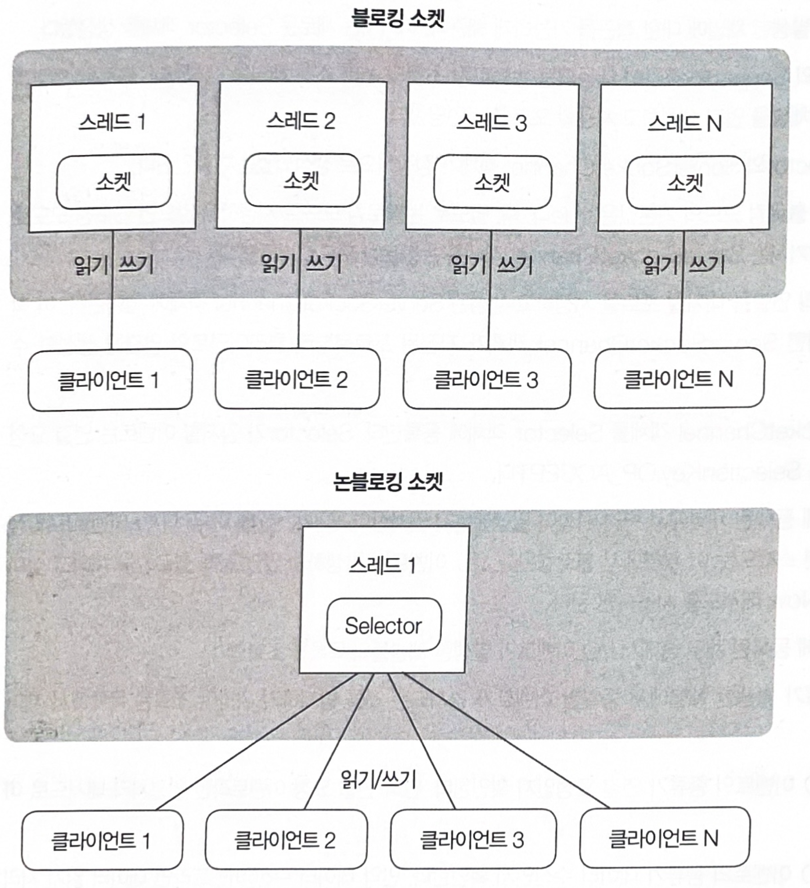

# 블로킹, 논블로킹 동작방식 비교
*****

소켓의 동작 방식이 다르므로 입출력을 위한 메서드 및 프로그램 호출 구조가 다르다.  
네티는 사용하는 소켓의 모드와 상관없이 개발할 수 있도록 추상화된 전송 API를 제공한다.  
> 블로킹 방식으로 개발을 해놓았다가 논블로킹 방식으로 변경한다고 해서 리팩토링이나 송수신 부분의 로직을 고치지 않고 사용이 가능하다.
